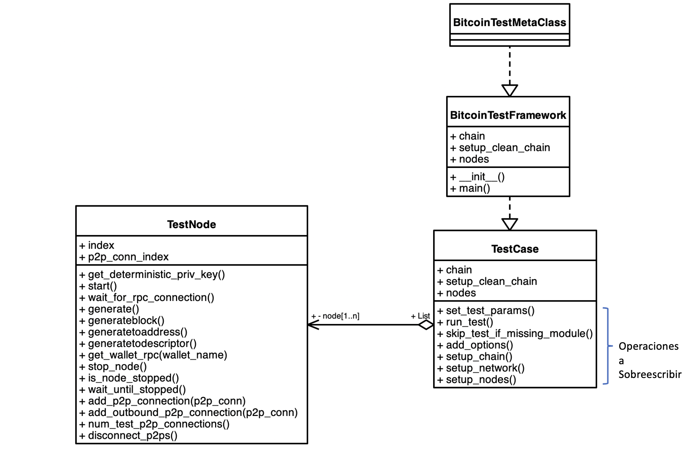
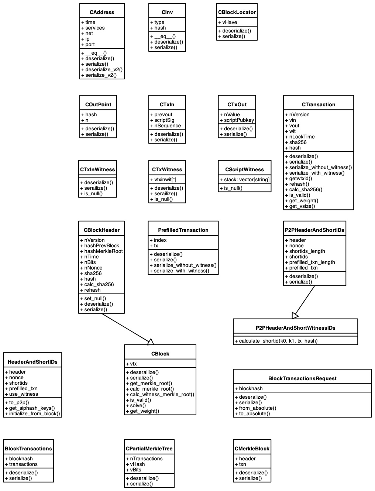
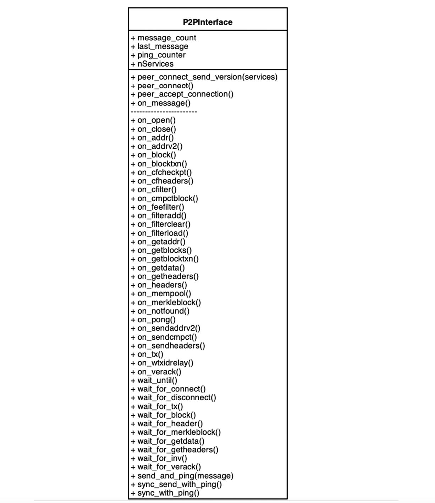

# Bitcoin Functional Test Framework

## Introducción al Framework de pruebas funcionales de Bitcoin

El framework se compone de una serie de clases y funciones de ayuda (Helper Functions). En estas notas presentaremos las clases con sus atributos y funciones principales (no en todos los casos se ponen todos los atributos o todos los métodos), para una referencia completa es importante revisar el código que se encuentra en el directorio [**_bitcoin/test/functional/test_framework_**](https://github.com/bitcoin/bitcoin/tree/master/test/functional) del código fuente de _Bitcoin core_. 

el framework de pruebas funcionales esta escrito en Python. He encontrado que las pruebas se pueden ejecutar desde _Visual Studio Code_ y también es posible hacer debbuging de las mismas directamente en el IDE, lo que facilita el proceso de construcción de pruebas.

## Clases principales

A continuación, se presentan las clases principales, toda prueba debe ser una clase que hereda de la clase _BitcoinTestFramework_, en el ejemplo de la imagen mas abajo, esta clase es _TestCase_.  Esta nueva clase _TestCase_ debe sobrescribir las funciones miembro (member functions) **_set_test_params_** y **_run_test_**. Del mismo modo, se pueden sobrescribir las funciones que se listan en la sección **_Operaciones a sobrescribir_**.  _TestCase_ es la clase que controla la prueba y tiene estos parámetros principales: 

* _`chain`_ que por defecto esta configurada para _`regtest`_ 
* _`setup_clean_chain`_ que se usa para definir una cadena de bloques iniciando desde el _Genesis block_ si se configura como `true`, de lo contrario si la configuramos como `false` el framework cargará 200 bloques de una cadena pre minada desde el disco, cuyas recompensas de minado se distribuyen entre 4 nodos. Cada nodo tiene 25 bloques con subsidio maduros (mas de 100 confirmaciones), igual a 25 x 50 = 1,250 bitcoins en su billetera.
* _`num_nodes`, Número de _TestNode_ a instanciar.
* _`nodes`_,  lista de los nodos _TestNode_ instanciados para la prueba.




Típicamente estos parámetros se configuran en la función **_set_test_params_**

Ejemplo:
``` python
def set_test_params(self):
        """Override test parameters for your individual test.
        This method must be overridden and num_nodes must be explicitly set."""
        # Iniciamos con una cadena limpia. Si inicias con una blockchain nueva, 
        # ninguno de los nodos tendrá bitcoin. 
        self.setup_clean_chain = True

        # Vamos a configurar 3 nodos (TestNode) conectados por default
        self.num_nodes = 3

        # Usa self.extra_args para cambiar los argumentos de línea de comando para
        # cada nodo por posición, para ver los argumentos puedes revisar el archivo
        # [src/init.cpp]
        self.extra_args = [[], ["-logips"], []]
```

Por lo general el framework establece una red de nodos lineal, es decir el nodo0 se conecta al nodo1 que a su vez se conecta la nodo2 y este último a su vez al nodo3. de la siguiente forma: `nodo0->nodo1->nodo2->nodo3`

La función _setup_newtork_ tiene la lógica de esta conexión lineal, pero podemos sobrescribirla si deseamos crear otro tipo de conexiones, por ejemplo, aislar un nodo temporalmente, o dividir la red en dos bloques de nodos cada una.

Ejemplo:

```python
   def setup_network(self):
        """Setup the test network topology
        Often you won't need to override this, since the standard network topology
        (linear: node0 <-> node1 <-> node2 <-> ...) is fine for most tests.
        If you do override this method, remember to start the nodes, assign
        them to self.nodes, connect them and then sync."""

        # Típicamente primero ejecutamos el set up de los nodos, aunque también  
        # podríamos sobrescribirlo si fuese necesario
        self.setup_nodes()

        # En este ejemplo solo estamos conectando el nodo0 con el nodo1
        # dejando fuera al nodo2, si llamáramos a sync_all() solo sincronizaría
        # el nodo1 con el nodo2

        self.connect_nodes(0, 1)
        self.sync_all(self.nodes[0:2])
```

Como podemos ver en el primer diagrama de estas notas, la clase _BitcoinTestFramework_ tiene varios métodos que pueden ser útiles para llevar a cabo la lógica de nuestras pruebas funcionales, por ejemplo: _stop_node_, _restart_node_, _connect_nodes_, _disconnect_nodes_, generate* para generar bloques y sync* para sincronizar bloques, mempool o ambos.

La función **_run_test_** es en donde deberemos escribir la lógica principal de nuestra prueba, es aquí en donde el uso de las funciones mencionadas del _BitcoinTestFramework_ pueden ser utilizadas. 

## Clases y funciones de apoyo

En el framework existen varios archivos con clases y funciones de apoyo, por ejemplo para crear transacciones, el archivo _messages.py_ contiene une serie de clases primitivas para poder armar una transacción compuesta de entradas y salidas.

En este diagrama podemos ver algunas de las clases primitivas que existen:



Ejemplo de como se puede construir una transacción:

``` python
    utxos = self.nodes[0].listunspent(0, 0)
    assert len(utxos) > 0
    utxo = utxos[0]
    """A 1in-1out transaction """
    tx = CTransaction()
    tx.vin = [CTxIn(COutPoint(int(utxo["txid"], 16), utxo["vout"]), REDEEM_SCRIPT)]
    tx.vout = [CTxOut(int(utxo["amount"] * COIN), P2SH)]
```
Nota importante, al construir transacciones es primordial que determines si tus transacciones van a ser estándar o no, en caso de que no, deberás iniciar el nodo con el parametro `self.extra_args = [["-acceptnonstdtxn=1"]]` en la función _set_test_params_.

Adicionalmente los siguientes archivos cuentan con clases y funciones de ayuda:
* adress.py, encode y decode de direcciones Bitcoin.
* blocktools.py, funciones para manipular bloques y transacciones.
* descriptors.py, funciones relacionadas con output descriptors.
* key.py, clases y funciones de la implementación de secp256k1 y criptografía
* messages.py, primitivas y estructura de mensajes.
* ripemd160.py, implementación Python de RIPEMD160 (solo para pruebas).
* script_util.py, funciones y constantes de Script.
* script.py, clases, funciones y constantes para construir scripts.
* segwit_addr, implementación de referencia para Bech32/Bech32m y direcciones segwit.
* util.py, funciones para pruebas de regresión.
* wallet_util.py, funciones para pruebas de wallet.
* wallet.py, una cartera (wallet) con funcionalidad limitada para remplazar la cartera en pruebas que no requieran la compilación de la cartera.

En estas notas no es posible describir cada una de las clases y funciones, pero conforme las vaya utilizando podré documentar un poco de algunas de ellas. Gran parte de la curva de aprendizaje del framework, es entender todos los casos de uso que pueden probarse, las reglas y bips de Bitcoin, así como  saber que clases y funciones pueden ayudar con la prueba. Explorando las pruebas que ya existen es posible ver como se utilizan varias de estas funciones y que parámetros requieren. 


## Interface de comunicación P2P

Un componente muy importante de las pruebas funcionales es la clase **_P2PInterface_**, esta clase permite crear objetos para probar el comportamiento del protocolo P2P, como lo comentamos _messages.py_ contiene las definiciones primitivas de los objetos (CBlock, CTransaction, etc) junto con las envolturas a nivel de red (mensajes) para ellos (msg_block, msg_tx, etc). Puedes consultar la [documentación del protocolo de mensajes Bitcoin](https://en.bitcoin.it/wiki/Protocol_documentation#version)

La clase _P2PInterface_ hereda de la clase _P2PConnection_ y contiene un número importante de callbacks que pueden ser sobrescritos, además de contener diversas funciones de wait* y sync*.



_P2PConnection_ es una clase que se utiliza para conectarse a las instancias bitcoind que corren los nodos (_TestNode_). _P2PInterface_ contiene una lógica de mayor nivel para procesar mensajes que se transmiten al nodo. Para modificar el comportamiento, se puede hacer una clase que herede de _P2PInterface_ y sobrescribir los métodos de callback.

Típicamente se utiliza una instancia que hereda de _P2PInterface_, si se quiere interactuar con un nodo bitoind en una forma particular y se pueda probar que el nodo se comporta de la forma esperada.  

Las pruebas P2P manejan dos hilos de procesamiento (threads), uno maneja toda la comunicación de red con los procesos de bitcoind (Nodos) que están siendo probados, en comunicación P2P, en un loop basado en callbacks; el otro implementa la lógica de la prueba.

## Sincronización

Importante:
* No esperes que las cosas sucedan en orden dentro de la lógica de la prueba
* Utiliza el `p2p_lock`.
* Utiliza `wait*`.
* Utiliza `sync_with_ping` para sincronizar una conexión.

La solución mas obvia para la sincronización es esperar a que todos terminen antes de continuar. Por lo que habrás identificado una serie de funciones de wait_for* y wait_until en el framework. 

Dentro del framework existe el siguiente código dentro de **_p2p.py_**:

```python
    p2p_lock = threading.Lock()
```
 
El `p2p_lock` es un mutex (MUTually EXclusive, una bandera en programación utilizada para obtener y liberar un objeto). Este `lock` sincroniza todos los datos entre los objetos de conexión P2P y la lógica de la prueba. Siendo mas precisos, mientras se utilice el `p2p_lock` puedes estar seguro de que tu código es _thread-safe_, accesando las estructuras de datos de tus nodos de conexión P2P. 

Ejemplo:
```python
    # Expect a getblocktxn message.
    with p2p_lock:
        assert "getblocktxn" in test_node.last_message
```

Las funciones wait_for* son abundantes en la _P2PInterface_ y por lo general son muy utilizadas para comprobar comportamiento esperado en las pruebas funcionales. Incluyen por ejemplo `wait_for_tx`, que permite asegurar que una conexión P2P recibe una transacción (por _tx hash_), `wait_for_disconnect`, que permite certificar que el nodo esta cerrando una conexión por mal comportamineto de sus pares.

Los `wait_until` permiten a tu prueba esperar por un predicado arbitrario para evaluar a `verdadero` (true).

Ejemplo:

```python
    p2p_conn_blocksonly.send_message(msg_getdata([CInv(MSG_CMPCT_BLOCK, block0.sha256)]))
    p2p_conn_blocksonly.wait_until(lambda: test_for_cmpctblock(block0))
```

Hasta aquí he llegado por ahora, conforme pueda ir construyendo pruebas nuevas podré ir actualizando/expandiendo esta guía, el siguiente paso es empezar a hacer experimentos con el framework, te invito a que hagas lo mismo y si es posible me ayudes a complementar esta guía.


